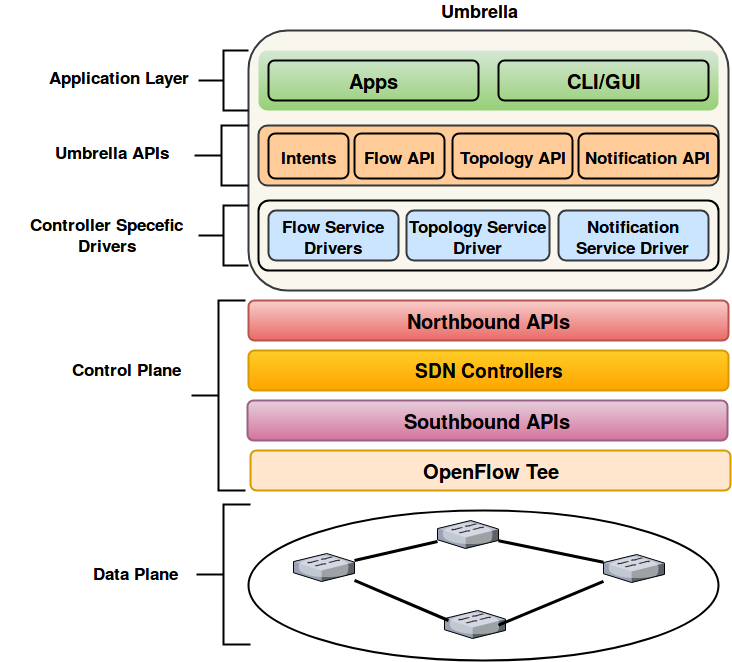

Overview
========

Introduction
-------------
The Northbound (NB) APIs that SDN controllers provide differ in terms of architecture, syntax, naming convention, data resources, and usage. Using NB APIs to write SDN applications makes each application dependent on the API of a specific controller. To bring NB APIs from different vendors under one umbrella and make programming of SDN applications independent of specific controllers, we designed and implemented a unified software defined development framework that we call Umbrella. The main design goals are as follows:

    * Design and implement a development framework that provides a new set of abstractions for SDN applications, keeping the abstractions independent of the NB APIs used by specific SDN controllers.
    * Design and implement a set of modules that use the proposed abstractions to provide information needed by SDN applications, such as topology, network statistics, and real time topology changes.
    * Increase portability of SDN applications across SDN controllers, and make it easy for a programmer to evaluate a specific application on multiple SDN controllers (e.g., to compare performance).
    * Provide a software defined network programming framework that reduces programming complexity, allows a programmer to write SDN applications without requiring a programmer to master low-level details for each SDN controller, and avoids locking an application to a specific controller.
    * Provide a framework uses a hybrid approach that utilizes both of reactive and proactive approach for managing and programming of SDN networks that offers better scalability than a completely reactive network management.

Umbrella Architecture
---------------------

We illustrate Umbrella architecture as follows: 

   
   
