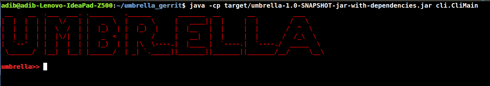

Umbrella User Interfaces
========================
We provide a short descritpion Umbrella user interfaces as follows:

Umbrella Command Line Interface
--------------------------------

We equipped Umbrella to a command line interface that can be executed as follows::

      $ java -cp target/umbrella-1.0-SNAPSHOT-jar-with-dependencies.jar cli.CliMain 

We illustrate Umbrella command line interface as follows: 

Umbrella command line interface provides a set of commands that can be used for retrieving topology information such as list of hosts, links, and network devices, set logger options, etc. Current version of Umbrella supports the following commands:

        Hosts
              DESCRIPTION
                 Displays list of the current hosts in the network topology.

              SYNTAX
                 hosts
              
              ARGUMENTS
                  NONE
                 

              OPTIONS
                 NONE

        Links
              DESCRIPTION
                 Displays list of the current links in the network topology.

              SYNTAX
                 links
              
              ARGUMENTS
                  NONE
                 

              OPTIONS
                 NONE

        Devices
              DESCRIPTION
                 Displays list of the current network devices in the network topology.

              SYNTAX
                 devices
              
              ARGUMENTS
                  NONE
                 

              OPTIONS
                 NONE

        Topo
              DESCRIPTION
                 Displays all topology information such as list of hosts, links, and network devices. 

              SYNTAX
                 topo
              
              ARGUMENTS
                  NONE
                 

              OPTIONS
                 NONE

        Setlog
              DESCRIPTION
                 Sets java log4j logger level (e.g. DEBUG, INFO, WARN, ...)

              SYNTAX
                 setlog
              
              ARGUMENTS
                  NONE
                 

              OPTIONS
                 -l --level
                     set log level      
       
        

How to add new commands? 
------------------------ 

To add a new command, we need to define a java class under **cli** package which implements a Runnable as follows: 

.. code-block:: java

   @CommandLine.Command(name = "commandName", header = "%n@|color Command Description|@")
     class newCommand implements Runnable {

    // Command Line options and arguments (For more information, please refer to http://picocli.info/)
    

    public void run() {

         // Logic behind the new command.

     }
   }

